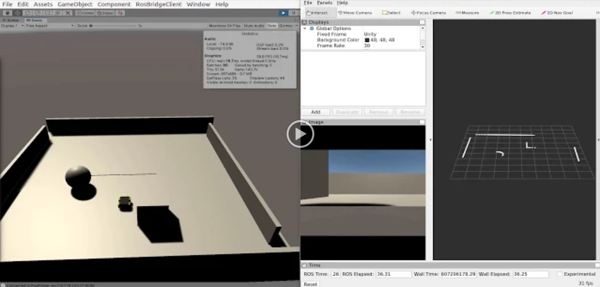

UNITY3D-ROS-SHARP
=================

Robot simulation in unity3d using [ros-sharp][__ROS_SHARP__]. For setup instructions refer to the same or read the [wiki][__ROS_SHARP_WIKI__].

Repository contains examples of what can be done with ROS#. For the associated ros-workspace refer to [repo][__ROS_WS__]

## Examples ##

Example [Scenes](Assets/Scenes/) `Assets/Scenes/`

* Turtlebot3 Burger
* Clearpath Jackal
* Clearpath Spot
* 3D Lidar [implementation][__3D_LIDAR__]

[][__DEMO_VID__]

---

[__ROS_SHARP__]: https://github.com/siemens/ros-sharp
[__DEMO_VID__]: https://drive.google.com/file/d/12BP77xk76YM_ZgNMoi_bgldBzQeYILOq/preview
[__ROS_SHARP_WIKI__]: https://github.com/siemens/ros-sharp/wiki
[__3D_LIDAR__]: Assets/Scripts/LaserScan3D/LaserScan3DReader.cs
[__ROS_WS__]: https://github.com/ironWolf1990/ros-workspace